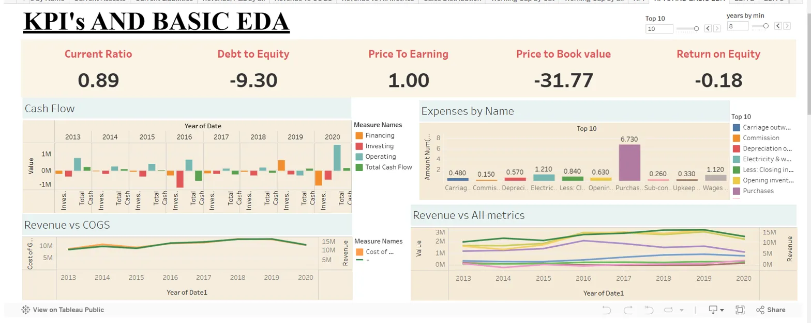
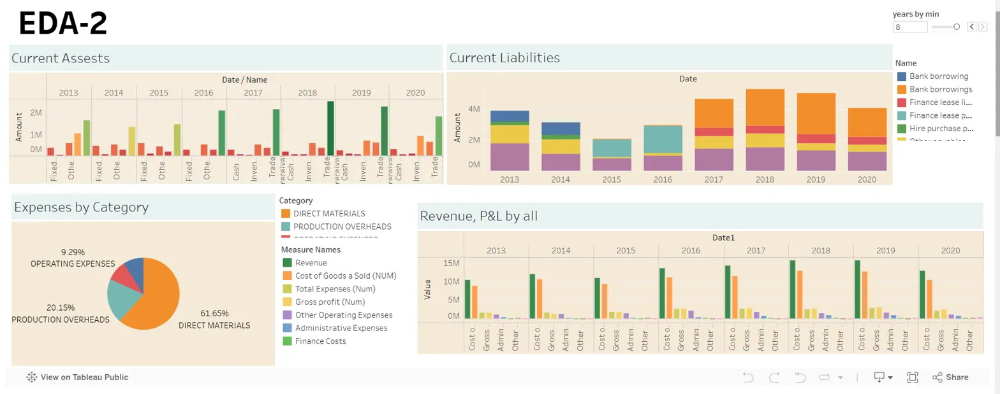
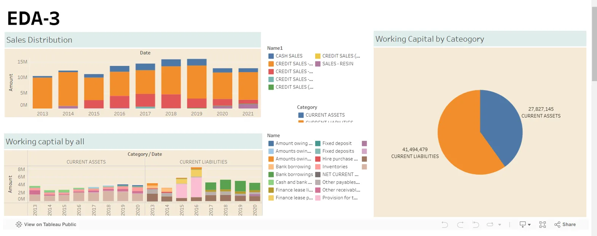

# Business-Case-Finance-Tableau
### Dashboard:

### Insights: 
-   -   KPI's and Basic EDA:
    -   Current Ratio: 0.89 - Indicates the company has relatively low current assets compared to its current liabilities.
    -   Debt to Equity: -9.30 - Suggests the company has significantly more equity than debt.
    -   Price to Earnings: 1.00 - Implies the stock price is equal to the company's earnings per share.
    -   Price to Book Value: -31.77 - Indicates the stock is trading at a significant discount to the company's book value.
    -   Return on Equity: -0.18 - Shows the company is generating negative returns on its equity.
-   Expenses by Name:
    -   Top expenses are Carriage & Commissions, Depreciation, Electricity & Water, and Less Closing Inventories.
-   Revenue vs All Metrics:
    -   Revenue has been relatively stable over the years, while other metrics like Cost of Goods Sold and Gross Profit have fluctuated more.
-   EDA-2:
    -   Current Assets have increased steadily from 2013 to 2020.
    -   Current Liabilities have also grown, with a notable increase in Bank Borrowings and Finance Lease Payables.
-   EDA-3:
    -   Sales Distribution shows a mix of Cash Sales, Credit Sales, and Sales-Resin, with Credit Sales being the largest component.
    -   Working Capital by Category indicates the company has significantly more Current Assets than Current Liabilities.

### Recommendations:
-    Improve Liquidity: The current ratio of 0.89 indicates potential liquidity issues. Explore strategies to increase current assets or reduce current liabilities, such as managing inventory more efficiently or negotiating better payment terms.
-   Optimize Capital Structure: With a debt-to-equity ratio of -9.30, investigate opportunities to take on more debt at favorable terms to improve the capital structure and potentially increase returns.
-   Review Pricing: The price-to-earnings ratio of 1.00 suggests the stock may be undervalued. Evaluate the pricing strategy to ensure alignment with the market and maximize profitability.
-   Manage Key Expenses: Focus on controlling the top expenses, including Carriage & Commissions, Depreciation, and Electricity & Water. Identify cost-saving opportunities through process improvements or technology investments.
-   Stabilize Revenue: Consider diversifying revenue sources or exploring new market segments to reduce volatility and drive consistent growth.
-   Optimize Working Capital: Review inventory, accounts receivable, and accounts payable to free up cash and improve liquidity.
-   Analyze Sales Mix: Understand the drivers behind the mix of Cash Sales, Credit Sales, and Sales-Resin, and identify opportunities to shift towards more profitable channels or products.
-   Leverage Excess Assets: Explore ways to deploy the surplus current assets, such as strategic investments, acquisitions, or shareholder distributions, to enhance shareholder value.
 
### Business Problem:

In this project, you will create a comprehensive company finance dashboard using Tableau. You have data on revenue, profit/loss, operational insights, expenses, current assets, liabilities, and cash flow – the vital components that drive the financial heartbeat of a company.

You have to create a dynamic and user-friendly dashboard that offers a bird's eye view of the company's financial health. Dive deep into the numbers, transforming raw data into insightful visualizations that empower decision-makers to glean actionable insights at a glance. Consider employing interactive elements, intuitive design, and a blend of charts, graphs, and tables to deliver a compelling narrative.
  
### [Dataset]('https://github.com/AbhinavTalmale/Business-Case-Finance-Tableau/tree/main/Dataset')

**Data Description:**

-   **Sales distribution data:**  Contains information on the distribution of sales across different categories and entities over time.
-   **Total expense data:**  Details the company's various expenses, categorized and recorded over time.
-   **Current assets balance sheet data:**  Provides an overview of the company's current assets, showing their financial health at different points in time.
-   **CashFlow pivot table data:**  Summarizes the company's cash flow from financing, investing, and operating activities, along with total cash flow, over time.
-   **Revenue profit PnL data:**  Contains a comprehensive profit and loss statement, detailing revenue, profits, and various expenses over the years.
-   **Current liabilities balance sheet data:**  Details the company's current liabilities, providing insights into their financial obligations at various times.
-   **Working capital balance sheet data:**  Summarizes the company's working capital, showing the balance between current assets and liabilities over time.
